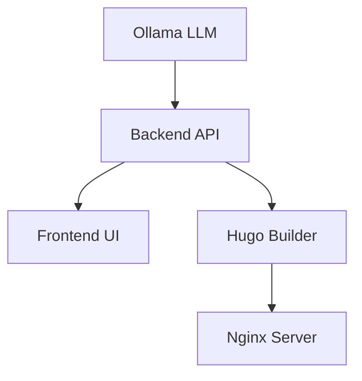

# 🚀 Hugo AI Studio

**AI-Powered Hugo Static Site Generator with Local LLM Integration**

A comprehensive, containerized solution that combines Hugo static site generation with AI-powered content creation using local LLMs. Users can input requirements through a beautiful Streamlit interface, and the system generates complete Hugo websites with AI-generated content.

## ✨ Key Features

- 🤖 **AI-Powered Content Generation** - Uses local Ollama LLM for privacy-focused content creation
- 🎨 **Multiple Site Types** - Blog, Portfolio, Business, Documentation templates
- 🔄 **Real-time Preview** - Live preview of generated sites
- 🐳 **Fully Containerized** - Docker-based microservices architecture
- 🌐 **Dynamic Site Serving** - Automatic nginx configuration for multiple sites
- 🔒 **Privacy-First** - All AI processing happens locally
- ⚡ **Fast Generation** - Optimized workflow for quick site creation
- 📱 **Responsive Design** - Mobile-friendly generated sites

## 🏗️ Architecture Overview

```
┌─────────────────┐    ┌─────────────────┐    ┌─────────────────┐
│   Frontend      │    │    Backend      │    │   LLM Service   │
│  (Streamlit)    │◄──►│   (FastAPI)     │◄──►│    (Ollama)     │
│   Port: 8501    │    │   Port: 8000    │    │  Port: 11434    │
└─────────────────┘    └─────────────────┘    └─────────────────┘
         │                       │                       │
         └───────────────────────┼───────────────────────┘
                                 ▼
         ┌─────────────────┐    ┌─────────────────┐
         │  Hugo Builder   │    │     Nginx       │
         │   (Background)  │    │  (Web Server)   │
         │                 │    │   Port: 8080    │
         └─────────────────┘    └─────────────────┘
```

## 📁 Project Structure

```
hugo-ai-studio/
├── 🐳 docker-compose.yml          # Orchestrates all services
├── 📋 .env.example               # Environment variables template
├── 📖 README.md                 # This file
├── 🔧 Makefile                  # Build and deployment commands
├──
├── 🎨 ai-hugo-frontend/         # Streamlit UI Application
│   ├── Dockerfile
│   ├── requirements.txt
│   ├── app.py               # Main Streamlit application
│   ├── components/          # UI components
│   │   ├── site_config.py   # Site configuration form
│   │   ├── content_generator.py  # Content generation interface
│   │   └── preview.py       # Live preview component
│   └── utils/
│       ├── llm_client.py    # Ollama client wrapper
│       └── hugo_generator.py # Hugo site generation logic
│
├── ⚡ ai-hugo-backend/         # FastAPI Backend
│   ├── Dockerfile
│   ├── requirements.txt
│   ├── main.py             # FastAPI application
│   ├── models/             # Pydantic models
│   │   ├── site_config.py
│   │   └── generation_request.py
│   ├── services/           # Business logic
│   │   ├── content_service.py
│   │   ├── hugo_service.py
│   │   └── llm_service.py
│   └── templates/          # Hugo site templates
│       ├── blog/
│       ├── portfolio/
│       ├── business/
│       └── documentation/
│
├── 🏗️ hugo-builder/           # Hugo Build Environment
│   ├── Dockerfile
│   └── scripts/
│       ├── build-site.sh
│       └── validate-site.sh
│
├── 🌐 nginx/                  # Web Server for Generated Sites
│   ├── Dockerfile
│   ├── nginx.conf          # ✅ Fixed configuration
│   └── custom-index.html   # Beautiful landing page
│
└── 💾 volumes/               # Persistent data
    ├── generated_sites/   # Generated Hugo sites
    ├── ollama_models/     # LLM models storage
    └── user_uploads/      # User uploaded content
```

## 🚀 Quick Start

### Prerequisites
- Docker and Docker Compose
- 8GB+ RAM (16GB recommended for larger models)
- NVIDIA GPU (optional, for faster LLM inference)

### 1. Clone and Setup
```bash
git clone https://github.com/shanojpillai/hugo-ai-studio.git
cd hugo-ai-studio
cp .env.example .env
# Edit .env with your settings if needed
```

### 2. Launch Services
```bash
# Start all services
docker-compose up -d

# Download LLM model (first time only)
docker exec hugo-ai-studio-ollama-1 ollama pull llama3.2

# Check service status
docker-compose ps
```

### 3. Access the Application
- **🎨 Hugo AI Studio**: http://localhost:8501
- **📚 API Documentation**: http://localhost:8000/docs
- **🌐 Generated Sites**: http://localhost:8080
- **🤖 Ollama LLM**: http://localhost:11434

## 🎯 How to Use

### Step 1: Site Configuration
1. Open http://localhost:8501
2. Navigate to **"Site Configuration"** in the sidebar
3. Fill out your site details:
   - Site name and description
   - Choose theme type (blog, portfolio, business, documentation)
   - Select main sections (About, Blog, Projects, Contact, etc.)
4. Click **"Save Configuration"**

### Step 2: Content Generation
1. Go to **"Content Generation"** in the sidebar
2. Choose content type and provide requirements
3. Set the tone (Formal, Professional, Casual, etc.)
4. Click **"Generate Content"** (requires LLM model)

### Step 3: Preview & Deploy
1. Navigate to **"Site Preview"**
2. View your generated site in real-time
3. Access your site at `http://localhost:8080/sites/{site-id}/`

## 🔧 Critical Fixes Applied

### ✅ Nginx Configuration Fixed
**Issue**: Syntax error in `nginx/nginx.conf` line 21
```nginx
# ❌ Before (broken)
sendfile        on;    keepalive_timeout  65;    server {

# ✅ After (fixed)
sendfile        on;
keepalive_timeout  65;

server {
```

### ✅ Service Communication Fixed
**Issue**: Hardcoded localhost URLs that don't work in Docker containers
```yaml
# ❌ Before
LLM_URL=http://localhost:11434
BACKEND_URL=http://localhost:8000

# ✅ After
LLM_URL=http://ollama:11434
BACKEND_URL=http://backend:8000
```

### ✅ LLM Model Updated
**Issue**: References to unavailable `llama2` model
```python
# ❌ Before
"model": params.get("model", "llama2")

# ✅ After
"model": params.get("model", "llama3.2")
```

### ✅ Dynamic Site Serving Added
**Issue**: Only hardcoded support for test-site
```nginx
# ✅ New: Dynamic regex pattern for any site
location ~ ^/sites/([^/]+)/?(.*)$ {
    alias /usr/share/nginx/html/sites/$1/public/$2;
    index index.html;
    try_files $uri $uri/ $uri/index.html =404;
    expires 1h;
    add_header Cache-Control "public, no-transform";

    # Enable CORS for development
    add_header Access-Control-Allow-Origin *;
}
```

## 🏗️ Technical Architecture

### Core Components

### 1. Frontend (Streamlit) - Port 8501
**Beautiful, intuitive interface for site creation**

- **Site Configuration**: Form-based setup for site details
- **Content Generation**: AI-powered content creation interface
- **Live Preview**: Real-time site preview and management
- **Responsive Design**: Works on desktop and mobile

### 2. Backend (FastAPI) - Port 8000
**RESTful API for site generation and management**

- **Site Creation**: `/sites` - Create new Hugo sites
- **Content Generation**: `/generate` - AI content creation
- **Site Management**: `/sites/{id}/content` - Update site content
- **Health Checks**: `/health` - Service status monitoring

### 3. LLM Service (Ollama) - Port 11434
**Local AI model for content generation**

- **Privacy-First**: All AI processing happens locally
- **Model Support**: llama3.2, llama3.1, codellama, etc.
- **Customizable**: Temperature, top_p, max_tokens configuration
- **GPU Acceleration**: NVIDIA GPU support for faster inference

### 4. Web Server (Nginx) - Port 8080
**Serves generated Hugo sites with dynamic routing**

- **Multi-Site Support**: `/sites/{site-id}/` routing
- **Static File Serving**: Optimized for Hugo sites
- **CORS Enabled**: Development-friendly headers
- **Caching**: Proper cache headers for performance

### 5. Hugo Builder (Background Service)
**Builds static sites from generated content**

- **Hugo Integration**: Latest Hugo v0.147.0
- **Theme Support**: Multiple built-in themes
- **Build Validation**: Ensures site integrity
- **Output Management**: Organized site deployment

## 🔧 Environment Configuration

### Required Environment Variables
```bash
# Service Ports
FRONTEND_PORT=8501
BACKEND_PORT=8000
NGINX_PORT=8080
OLLAMA_PORT=11434

# Service URLs (Docker network names)
BACKEND_URL=http://backend:8000
LLM_URL=http://ollama:11434

# Streamlit Configuration
STREAMLIT_SERVER_ADDRESS=0.0.0.0
STREAMLIT_SERVER_PORT=8501

# FastAPI Configuration
FASTAPI_HOST=0.0.0.0
FASTAPI_PORT=8000

# Ollama Configuration
OLLAMA_HOST=0.0.0.0
OLLAMA_PORT=11434

# LLM Model Configuration
DEFAULT_MODEL=llama3.2
MODEL_TEMPERATURE=0.7
MODEL_TOP_P=0.9
MODEL_MAX_TOKENS=2048
```

## 🐳 Docker Services

### Service Dependencies


### Health Checks
All services include health checks for reliable startup:
```yaml
healthcheck:
  test: ["CMD", "curl", "-f", "http://localhost:8000/health"]
  interval: 30s
  timeout: 10s
  retries: 3
```

## 🚀 Available Commands

### Development Commands
```bash
# Start all services
make up

# Stop all services
make down

# View logs
make logs

# Restart specific service
make restart service=frontend

# Pull latest LLM model
make pull-model model=llama3.2

# Clean up everything
make clean
```

### Manual Docker Commands
```bash
# Start services
docker-compose up -d

# Check status
docker-compose ps

# View logs
docker-compose logs -f [service-name]

# Stop services
docker-compose down

# Rebuild services
docker-compose build --no-cache

# Download LLM model
docker exec hugo-ai-studio-ollama-1 ollama pull llama3.2
```

## 🔍 Troubleshooting

### Common Issues

#### 1. Nginx 404 Error
**Problem**: Getting 404 when accessing http://localhost:8080
**Solution**:
```bash
# Restart nginx service
docker-compose restart nginx

# Check nginx logs
docker-compose logs nginx

# Verify configuration
docker exec hugo-ai-studio-nginx-1 nginx -t
```

#### 2. LLM Model Not Found
**Problem**: Content generation fails with model errors
**Solution**:
```bash
# Check available models
docker exec hugo-ai-studio-ollama-1 ollama list

# Download required model
docker exec hugo-ai-studio-ollama-1 ollama pull llama3.2

# Check Ollama service
curl http://localhost:11434/api/version
```

#### 3. Service Communication Issues
**Problem**: Services can't communicate with each other
**Solution**:
```bash
# Check network connectivity
docker network ls
docker network inspect hugo-ai-studio_hugo-network

# Restart all services
docker-compose down && docker-compose up -d
```

#### 4. Port Conflicts
**Problem**: Ports already in use
**Solution**:
```bash
# Check what's using the ports
netstat -tulpn | grep :8501
netstat -tulpn | grep :8000
netstat -tulpn | grep :8080

# Modify ports in docker-compose.yml if needed
```

## 📊 Performance & Monitoring

### Resource Requirements
- **Minimum**: 4GB RAM, 2 CPU cores
- **Recommended**: 8GB RAM, 4 CPU cores
- **With GPU**: 16GB RAM, NVIDIA GPU with 8GB+ VRAM

### Monitoring Endpoints
```bash
# Service health checks
curl http://localhost:8000/health      # Backend API
curl http://localhost:8501/_health     # Frontend (if implemented)
curl http://localhost:11434/api/version # Ollama LLM

# Nginx status
curl http://localhost:8080/nginx_status # (if enabled)
```

### Performance Optimization
```yaml
# docker-compose.yml optimizations
deploy:
  resources:
    limits:
      memory: 4G
      cpus: '2.0'
    reservations:
      memory: 2G
      cpus: '1.0'
```

## 🔐 Security Considerations

### Production Deployment
```bash
# Use environment-specific configs
cp .env.example .env.production

# Set secure values
ENVIRONMENT=production
DEBUG=false
ALLOWED_HOSTS=yourdomain.com
CORS_ORIGINS=https://yourdomain.com
```

### Network Security
```yaml
# Restrict external access in production
networks:
  hugo-network:
    driver: bridge
    internal: true  # Only for internal services
```

## 🤝 Contributing

### Development Setup
```bash
# Clone repository
git clone https://github.com/shanojpillai/hugo-ai-studio.git
cd hugo-ai-studio

# Create development environment
cp .env.example .env.dev

# Start development services
docker-compose -f docker-compose.dev.yml up -d

# Run tests
make test
```

### Code Quality
```bash
# Pre-commit hooks
pre-commit install

# Run linting
make lint

# Format code
make format

# Type checking
make typecheck
```

## 📝 API Documentation

### Backend Endpoints

#### Site Management
```http
POST /sites
Content-Type: application/json

{
  "site_name": "My Blog",
  "site_description": "A personal blog",
  "theme_type": "blog",
  "main_sections": ["About", "Blog", "Contact"]
}
```

#### Content Generation
```http
POST /generate
Content-Type: application/json

{
  "prompt": "Write a blog post about AI",
  "params": {
    "model": "llama3.2",
    "temperature": 0.7,
    "max_tokens": 1000
  }
}
```

#### Site Content Update
```http
PUT /sites/{site_id}/content
Content-Type: application/json

{
  "pages": {
    "about": "# About Me\nContent here...",
    "blog/post1": "# My First Post\nContent here..."
  }
}
```

### Response Formats
```json
{
  "site_id": "uuid-string",
  "status": "completed|in_progress|error",
  "preview_url": "http://localhost:8080/sites/{site_id}/",
  "created_at": "2025-01-01T00:00:00Z"
}
```

## 🎨 Supported Site Types

### Blog
- Personal blogs with AI-generated posts
- Category and tag management
- RSS feed generation
- Comment system integration

### Portfolio
- Project showcases with descriptions
- Image galleries and demos
- Skills and experience sections
- Contact forms

### Business
- Company websites with service pages
- Team member profiles
- Testimonials and case studies
- SEO-optimized content

### Documentation
- Technical documentation sites
- API documentation
- User guides and tutorials
- Search functionality

## 🌟 Features in Detail

### AI Content Generation
- **Smart Prompting**: Context-aware content generation
- **Multiple Formats**: Blog posts, pages, product descriptions
- **SEO Optimization**: Automatic meta tags and descriptions
- **Tone Control**: Formal, casual, professional, creative styles

### Hugo Integration
- **Latest Hugo**: Version 0.147.0 with all features
- **Theme Support**: Multiple built-in themes
- **Custom Layouts**: Flexible template system
- **Fast Builds**: Optimized build process

### Dynamic Serving
- **Multi-Site Support**: Host multiple sites simultaneously
- **Auto-Discovery**: New sites automatically available
- **Custom Domains**: Easy domain configuration
- **SSL Support**: HTTPS ready for production

## 📈 Roadmap

### Version 2.0 (Planned)
- [ ] Custom theme editor
- [ ] Advanced AI models (GPT-4, Claude)
- [ ] Multi-language support
- [ ] E-commerce integration
- [ ] Advanced analytics
- [ ] Team collaboration features

### Version 1.5 (In Progress)
- [x] ✅ Fixed nginx configuration
- [x] ✅ Dynamic site serving
- [x] ✅ Improved error handling
- [ ] 🔄 Custom domain support
- [ ] 🔄 Advanced theme customization
- [ ] 🔄 Content scheduling

## 📞 Support & Community

### Getting Help
- **GitHub Issues**: [Report bugs and request features](https://github.com/shanojpillai/hugo-ai-studio/issues)
- **Discussions**: [Community discussions and Q&A](https://github.com/shanojpillai/hugo-ai-studio/discussions)
- **Documentation**: This README and inline code comments

### Contributing
We welcome contributions! Please see our contributing guidelines:

1. **Fork the repository**
2. **Create a feature branch**: `git checkout -b feature/amazing-feature`
3. **Commit your changes**: `git commit -m 'Add amazing feature'`
4. **Push to the branch**: `git push origin feature/amazing-feature`
5. **Open a Pull Request**

### License
This project is licensed under the MIT License - see the [LICENSE](LICENSE) file for details.

## 🙏 Acknowledgments

- **Hugo**: Fast and flexible static site generator
- **Ollama**: Local LLM inference engine
- **Streamlit**: Beautiful web app framework
- **FastAPI**: Modern, fast web framework for APIs
- **Docker**: Containerization platform
- **Nginx**: High-performance web server

## 📊 Project Stats

- **Languages**: Python, JavaScript, HTML, CSS
- **Frameworks**: FastAPI, Streamlit, Hugo
- **Container**: Docker, Docker Compose
- **AI Models**: Ollama (llama3.2, codellama, etc.)
- **Web Server**: Nginx with custom configuration

---

**🚀 Ready to create amazing websites with AI? Get started now!**

```bash
git clone https://github.com/shanojpillai/hugo-ai-studio.git
cd hugo-ai-studio
docker-compose up -d
```

Visit http://localhost:8501 and start building! 🎉

